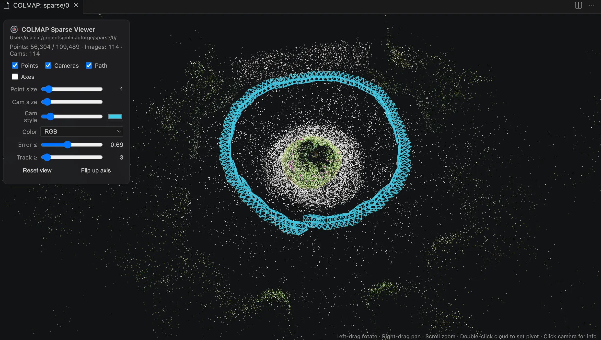
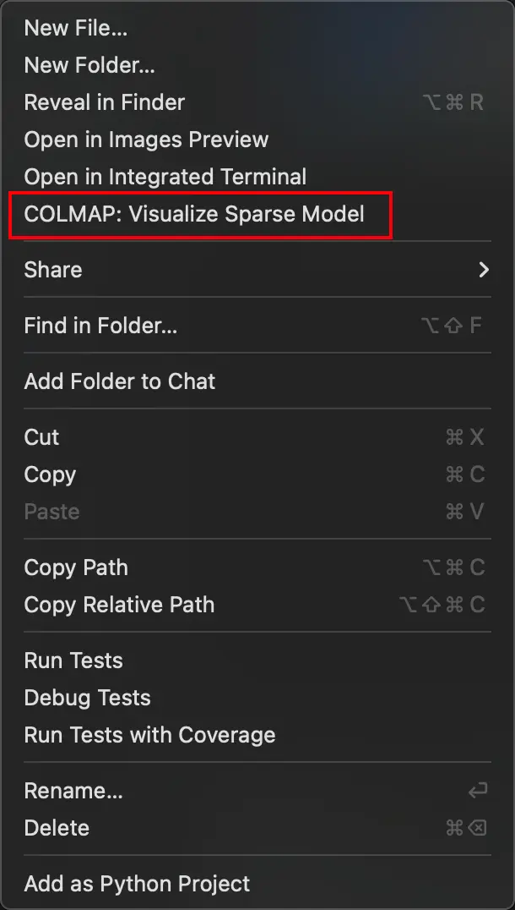

# COLMAP Sparse Viewer

Visualize COLMAP sparse reconstructions (3D point cloud + camera poses) directly inside VS Code, powered by Three.js.



## Features

- Reads standard COLMAP sparse models: `cameras` / `images` / `points3D` in **`.bin`** or **`.txt`** format
- Renders the sparse point cloud with true RGB colors, plus reprojection-error and height color modes
- Draws every registered image as a camera frustum (with an "up" indicator), sized by its actual intrinsics; frustum size, line width and color are all adjustable
- Optional camera trajectory polyline (ordered by image name)
- Filters: max reprojection error, min track length
- Click a frustum to inspect image name / camera model / position; double-click the cloud to re-center the orbit pivot
- Handles all COLMAP camera models (IDs 0–10) plus common extensions (division, fisheye, EUCM, equirectangular)

## Usage

- **Double-click** any `cameras.bin`, `images.bin`, or `points3D.bin` in the Explorer, or
- **Right-click a folder** (e.g. `sparse/0`, or any ancestor — the model is auto-discovered up to 3 levels deep) → *COLMAP: Visualize Sparse Model*, or
- Run **`COLMAP: Visualize Sparse Model`** from the command palette and pick a folder.



## Controls

| Action | Effect |
|---|---|
| Left drag | Orbit |
| Right drag | Pan |
| Scroll | Zoom |
| Click frustum | Show image info |
| Double-click cloud | Set orbit pivot |

## Development

```bash
git clone https://github.com/Vincentqyw/vscode-colmap-viewer.git
cd vscode-colmap-viewer
npm install
npm run build      # bundle extension + webview
npm run package    # create .vsix
```

Install the generated `.vsix` with `code --install-extension colmap-sparse-viewer-<version>.vsix`.

## License

MIT © [Vincent Qin](https://github.com/Vincentqyw)
